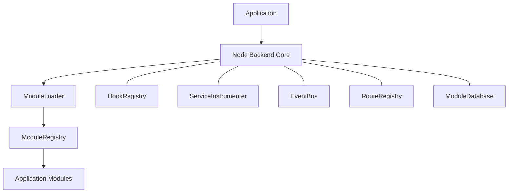
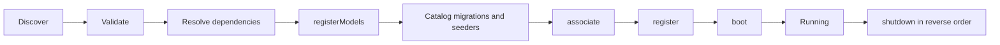

# Node Backend Core

[](../../actions/workflows/ci.yml)
[](https://nodejs.org/)
[](LICENSE)

**A modular backend foundation for building scalable Node.js APIs.**

Node Backend Core is reusable infrastructure for composing backend applications
from independently maintained modules. It is a framework foundation, not a
complete SaaS application or a preconfigured business domain.

## Overview

The Core provides module discovery and loading, dependency resolution, lifecycle
management, service instrumentation, hooks, an in-process EventBus, route and
middleware registries, database resource cataloging, request context, HTTP error
handling, Swagger/OpenAPI generation, Docker support and automated tests.

Applications supply their own modules and business integrations. The default
configuration starts with an empty module list and exposes only the health route.

## Features

- Dynamic local and package module loading
- Required and optional module dependency resolution
- Model, association, registration, boot and shutdown lifecycle
- Service instrumentation with cached proxies
- Before, after and error hooks
- In-process EventBus with synchronous and asynchronous delivery
- Route registry and middleware resolution
- Sequelize/MySQL connection and module migration metadata
- Request-scoped context with AsyncLocalStorage
- Reusable controller, service, repository, validator, mapper and DTO classes
- Consistent API responses and typed HTTP exceptions
- Swagger/OpenAPI document generation
- Docker and Docker Compose configuration
- Unit and integration test setup

## Architecture



The Core owns infrastructure and lifecycle coordination. Modules own their
models, routes, services, migrations and domain behavior.

## Module lifecycle

For each application start, the loader performs the following sequence:



Migration and seeder paths are validated and cataloged during initialization.
The migration CLI executes migrations explicitly; application startup does not
change the database schema automatically. Startup failures also trigger cleanup.

## Request flow

Feature modules can follow the standard backend flow:

```text
route -> validator -> controller -> service -> repository -> Sequelize
```

The Core supplies the base classes and HTTP infrastructure while each module
chooses its concrete implementation.

## Minimal module example

An installed module exports a contract like this:

```js
module.exports = {
    name: "example",
    version: "1.0.0",
    dependencies: [],
    optionalDependencies: [],

    registerModels(context) {
        // Define models with context.sequelize.
    },

    associate(context) {
        // Add associations after every module has defined its models.
    },

    async register({ router }) {
        // Register routes on the shared router.
    },

    async boot(context) {
        // Start module resources.
    },

    async shutdown(context) {
        // Release module resources.
    },

    migrations: [],
    seeders: []
};
```

Only name, version and register are required. Dependencies must use module names,
and lifecycle hooks must return or await their work.

## Getting started

Requirements:

- Node.js 22 or newer
- MySQL 8.4 for the running API and integration test
- Docker and Docker Compose (optional)

```bash
git clone <repository-url>
cd node-backend-core
npm install
cp .env.example .env
npm test
npm start
```

npm start authenticates the configured MySQL connection before opening HTTP.
Use npm run dev for a nodemon development process.

To run the API and MySQL together, set DB_PASSWORD and
MYSQL_ROOT_PASSWORD in .env, then run:

```bash
docker compose up --build
```

## Configuration

Copy .env.example to .env and provide local values. Never commit .env.

| Variable | Purpose |
| --- | --- |
| NODE_ENV | Runtime environment name |
| PORT | Host port for the API |
| DB_HOST | MySQL hostname |
| DB_PORT | MySQL port |
| DB_NAME | Database name |
| DB_USER | Database user |
| DB_PASSWORD | Database password |
| MYSQL_ROOT_PASSWORD | Root password used by Docker Compose MySQL |
| MYSQL_PORT | Host port mapped to MySQL |
| LOG_LEVEL | Winston log level |

## API documentation

When the server is running:

- GET /health reports API and MySQL availability.
- GET /api/docs serves the Swagger UI.
- GET /api/docs.json returns the generated OpenAPI document.

## Testing

Run the self-contained suite with:

```bash
npm test
```

The current suite reports 55 passing tests and 2 skipped integration-dependent
tests. The skipped database test runs when TEST_DB_* variables are supplied.

## Project structure

```text
src/
├── common/       Shared base classes, errors, responses and context
├── config/       Generic runtime configuration
├── core/         Module, route, service and migration infrastructure
├── database/     Sequelize connection and module database resources
├── docs/         OpenAPI definitions
├── middlewares/  Generic HTTP middleware
├── modules/      Application-provided modules
└── routes/       Core routes

tests/            Unit and opt-in integration tests
docs/             Architecture and module documentation
```

## Design principles

- The Core stays domain-agnostic.
- Modules own business functionality and data models.
- Modules communicate through declared dependencies and public contracts.
- Events and hooks are application-scoped, in-process infrastructure.
- Database migrations are explicit deployment steps.
- Application-specific integrations stay outside the Core.

## License

This project is licensed under the ISC License. See [LICENSE](LICENSE).
